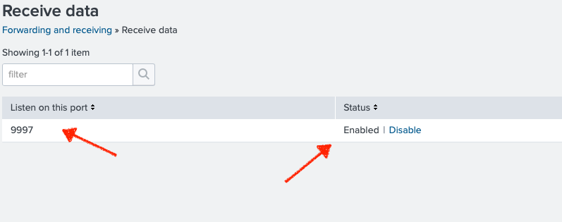

# Data Sources Configuration

## Overview
This section covers the setup of local data sources for ingestion into our SIEM solution using Splunk.

### Local Logs Configuration

1. **Choosing Data Source**:
   - **Description**: Select the type of data you want to send to Splunk. Options include cloud computing, networking, operating systems, or security.
   - **Screenshot**:
     

2. **Uploading Log Files**:
   - **Description**: Upload log files directly from your computer, such as `cisco_ironport_web.log`, `MOCK_DATA.csv`, `access.log`, and `secure.log`.
   - **Screenshot**:
     

3. **Setting Source Type**:
   - **Description**: Configure the source type and parsing rules for each log file. This example shows setting the source type for the Cisco IronPort log file.
   - **Screenshot**:
     

4. **Detailed Process**:
   - **Select Source File**: Drag and drop your file (e.g., `cisco_ironport_web.log`) for upload.
     

   - **Configure Source Type**: Adjust source type settings, using pre-defined templates like `cisco:asa` or custom settings.
     

### Splunk Universal Forwarder Configuration

1. **Download and Install**:
   - **Description**: Download and install the Splunk Universal Forwarder on your host PC.
   - **Screenshot**:
     
   - Install command:
     ```bash
     sudo installer -pkg <path-to-installer> -target /
     ```

2. **Configure the Forwarder**:
   - **Enable boot start and start the forwarder**:
     ```bash
     cd /Applications/SplunkForwarder/bin
     sudo ./splunk enable boot-start
     sudo ./splunk start
     ```
   - **Add the Splunk server as a receiver**:
     - Step 1:
       
     - Step 2:
       
     - Step 3:
       
     ```bash
     sudo ./splunk add forward-server <your forwarder-ip>:9997
     ```

3. **Configure Inputs**:
   - **Edit the `inputs.conf` file to specify logs to forward**:
     ```bash
     cd /Applications/SplunkForwarder/etc/system/local
     sudo nano inputs.conf
     ```
   - Example entries:
     ```ini
     [monitor:///var/log/system.log]
     disabled = false

     [monitor:///var/log/secure.log]
     disabled = false
     ```

4. **Verify Forwarder Status**:
   - **Check the forwarder status**:
     
     ```bash
     sudo ./splunk list forward-server
     ```

5. **Verify Data Ingestion**:
   - **Confirm logs from the host PC are visible in the Splunk dashboard**:
     

### Verification
- Confirm that all local logs and forwarded data are successfully ingested and visible in the Splunk dashboard. Check for correct data parsing and timestamps.

### Next Steps
- Continue to monitor the ingestion of logs and adjust configurations as necessary.
- Further refine data parsing and field extraction.

## Conclusion
This configuration ensures that local logs and data from the Splunk Universal Forwarder are effectively ingested for monitoring and analysis. Further steps will enhance data ingestion automation and improve security monitoring.
